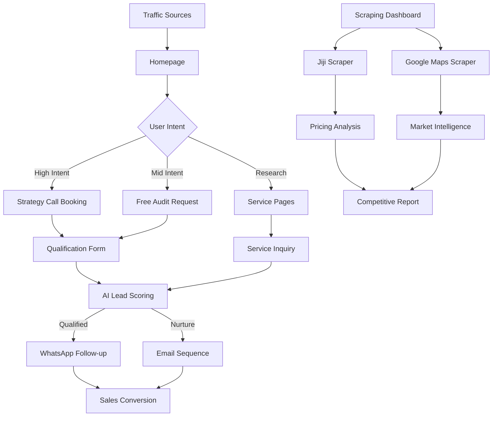

## 1. Product Overview
Bethelmind Analytics is a comprehensive lead generation and business intelligence platform that combines web scraping, funnel analytics, and automated lead management to help Nigerian businesses acquire customers and monitor market trends. The platform scrapes data from Jiji marketplace and Google Maps, tracks user conversion funnels, and automates WhatsApp follow-ups.

The system solves three core problems: customer acquisition through data-driven lead generation, market intelligence through competitive analysis, and sales automation through intelligent funnel tracking and WhatsApp integration.

## 2. Core Features

### 2.1 User Roles
| Role | Registration Method | Core Permissions |
|------|---------------------|------------------|
| Business Owner | Email registration | Access to scraping tools, view analytics, manage leads |
| Sales Manager | Admin invitation | Manage leads, view funnel analytics, export data |
| Admin | System setup | Full system access, user management, system configuration |

### 2.2 Feature Module
Our platform requirements consist of the following main pages:
1. **Homepage**: Hero section, service showcase, lead capture forms, conversion tracking
2. **Funnel Analytics Dashboard**: Real-time conversion tracking, event analysis, performance metrics
3. **Lead Management Interface**: Lead scoring, WhatsApp integration, follow-up automation
4. **Scraping Dashboard**: Jiji marketplace data, Google Maps business listings, competitive analysis
5. **Campaign Management**: Facebook Ads integration, performance tracking, budget optimization
6. **Admin Control Panel**: Content management, user administration, system monitoring

### 2.3 Page Details
| Page Name | Module Name | Feature description |
|-----------|-------------|---------------------|
| Homepage | Hero Section | Display conversion-optimized headlines, primary CTA for strategy calls, secondary CTA for free audits, social proof elements with client logos |
| Homepage | Lead Capture Forms | Implement multi-step qualification forms, budget filtering, timeline assessment, industry classification |
| Homepage | Conversion Tracking | Track page views, WhatsApp clicks, lead magnet submissions, contact form submissions, calculate conversion rates |
| Funnel Analytics | Event Dashboard | Display real-time event counts, conversion rates between funnel stages, lead-ready signals, device-local analytics |
| Funnel Analytics | Performance Metrics | Show views to WhatsApp click rates, views to lead magnet conversion, contact submission rates, comprehensive event breakdown |
| Lead Management | Lead Scoring System | Implement AI-powered lead scoring using Gemini API, automatic qualification based on keywords, priority assignment |
| Lead Management | WhatsApp Integration | Automated follow-up sequences, 7-day nurture campaigns, immediate response triggers, hot lead alerts |
| Scraping Dashboard | Jiji Marketplace Scraper | Search and scrape product listings, extract pricing data, location mapping, competitive analysis, bulk data export |
| Scraping Dashboard | Google Maps Integration | Business listings extraction, location-based lead generation, contact information gathering, market mapping |
| Campaign Management | Facebook Ads Sync | Campaign performance tracking, CTR monitoring, budget optimization, high-performing campaign detection |
| Admin Panel | Content Management | Dynamic content updates, SEO optimization, meta tag management, media library management |
| Admin Panel | User Management | Role-based access control, user activity monitoring, permission management, system configuration |

## 3. Core Process

### Lead Generation Flow:
1. **Traffic Acquisition**: Users arrive through Facebook Ads, SEO, or social media
2. **Homepage Engagement**: Users interact with hero section, view service offerings
3. **Qualification Trigger**: Users click "Book Strategy Call" or "Get Free Audit"
4. **Form Submission**: Multi-step qualification form collects budget, timeline, industry data
5. **Lead Scoring**: AI system evaluates lead quality based on responses and keywords
6. **WhatsApp Integration**: Qualified leads receive immediate WhatsApp follow-up
7. **Nurture Sequence**: 7-day automated email and WhatsApp nurture campaign
8. **Conversion**: Sales team receives hot lead alerts for high-priority prospects

### Data Scraping Flow:
1. **Search Initiation**: User enters search terms for Jiji products or Google Maps locations
2. **Automated Scraping**: System scrapes multiple pages with rate limiting and delays
3. **Data Processing**: Extract pricing, locations, contact information, duplicate removal
4. **Analysis Generation**: Competitive pricing analysis, market insights, keyword extraction
5. **Dashboard Update**: Real-time dashboard updates with new scraping data
6. **Export Functionality**: Data export capabilities for external analysis

## 4. User Interface Design

### 4.1 Design Style
- **Primary Colors**: Deep blue (#1e40af) for trust, cream (#fef7ed) for backgrounds
- **Secondary Colors**: Green (#10b981) for success, orange (#f97316) for CTAs
- **Button Style**: Rounded corners with hover animations, 3D subtle shadows
- **Typography**: Modern sans-serif fonts, 16px base size, clear hierarchy
- **Layout**: Card-based design with generous whitespace, responsive grid system
- **Icons**: Professional line icons, consistent stroke width, intuitive metaphors

### 4.2 Page Design Overview
| Page Name | Module Name | UI Elements |
|-----------|-------------|-------------|
| Homepage | Hero Section | Full-width hero with animated headline, dual CTA buttons, client logo carousel, conversion tracking pixels |
| Funnel Analytics | Metrics Dashboard | Clean card layout with KPI tiles, conversion rate charts, real-time event counters, export functionality |
| Scraping Dashboard | Data Tables | Sortable tables with search filters, pricing trend graphs, location maps, competitive analysis cards |
| Lead Management | Lead Pipeline | Kanban-style lead board, priority indicators, WhatsApp status badges, automated action buttons |
| Campaign Management | Performance Charts | Line graphs for CTR trends, budget utilization bars, campaign comparison tables, alert notifications |

### 4.3 Responsiveness
- **Desktop-First**: Optimized for 1920x1080 and 1366x768 resolutions
- **Mobile Adaptive**: Responsive breakpoints at 768px and 480px
- **Touch Optimization**: Larger tap targets on mobile, swipe gestures for navigation
- **Cross-Browser**: Full support for Chrome, Firefox, Safari, Edge

### 4.4 3D Scene Guidance
Not applicable - this is a business analytics platform focused on data visualization rather than 3D content.