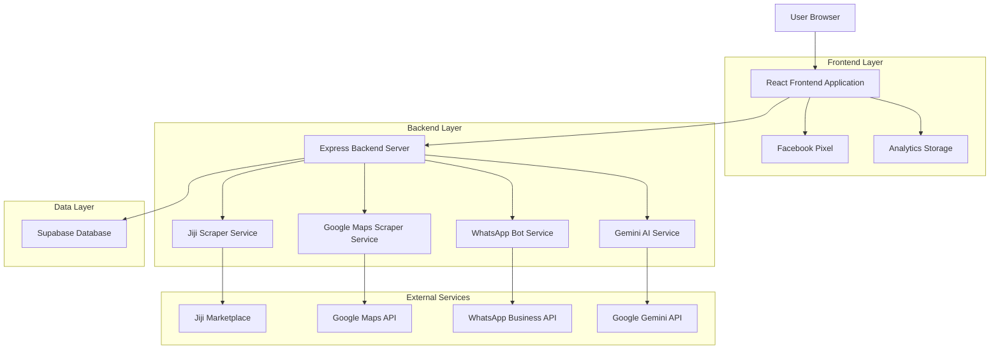
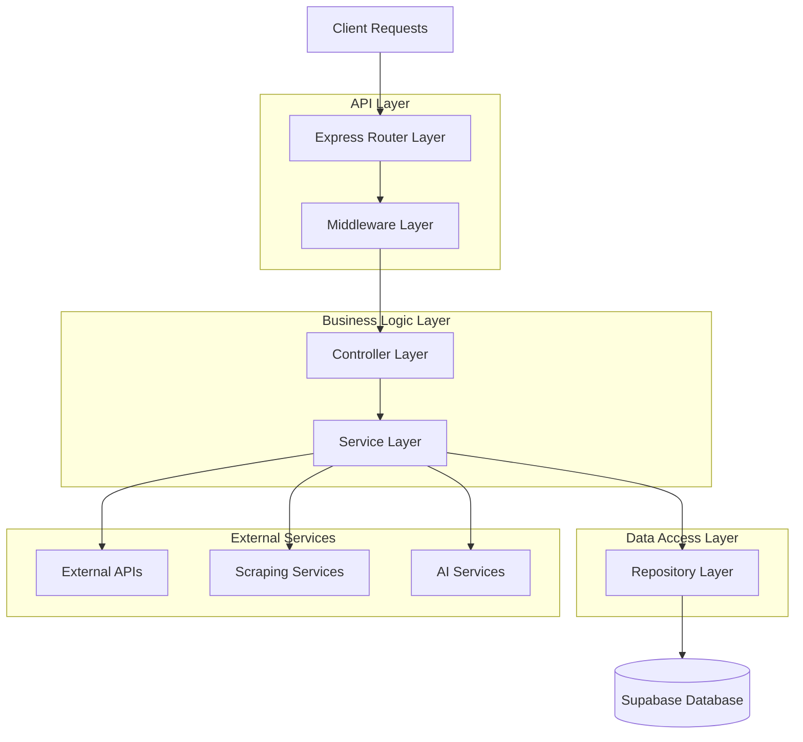
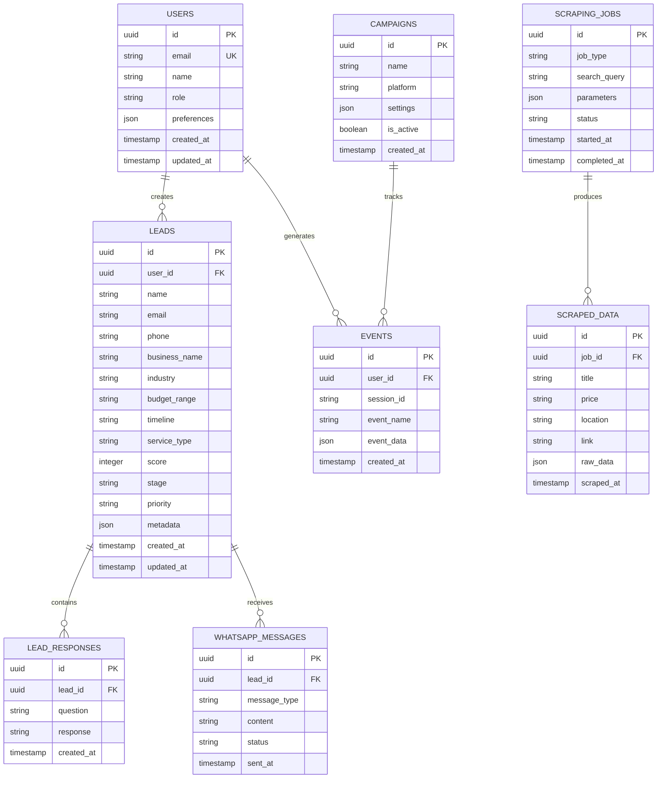

## 1. Architecture design



## 2. Technology Description
- **Frontend**: React@18 + TypeScript + TailwindCSS@3 + Vite
- **Backend**: Express@5 + Node.js + TypeScript
- **Database**: Supabase (PostgreSQL) with real-time subscriptions
- **AI/ML**: Google Gemini API for lead scoring and content analysis
- **Web Scraping**: Axios + Cheerio for Jiji, Puppeteer for Google Maps
- **Messaging**: WhatsApp Business API integration
- **Analytics**: Facebook Pixel, custom event tracking
- **Initialization Tool**: vite-init

## 3. Route definitions

| Route | Purpose |
|-------|---------|
| / | Homepage with lead capture and conversion tracking |
| /funnel-analytics | Real-time funnel performance dashboard |
| /dashboard | Lead management and scraping data interface |
| /admin | Content management and system administration |
| /api/auth/* | Authentication and user management endpoints |
| /api/scrape/* | Web scraping endpoints for Jiji and Google Maps |
| /api/leads/* | Lead management and scoring endpoints |
| /api/whatsapp/* | WhatsApp integration and messaging endpoints |
| /api/analytics/* | Event tracking and funnel analytics endpoints |

## 4. API definitions

### 4.1 Scraping APIs

**Jiji Scraper Endpoint**
```
POST /api/scrape/jiji
```

Request:
| Param Name | Param Type | isRequired | Description |
|------------|------------|------------|-------------|
| searchTerm | string | true | Product/service to search for |
| pageCount | number | false | Number of pages to scrape (max 3) |
| maxResults | number | false | Maximum results to return (max 60) |
| delayMs | number | false | Delay between requests in milliseconds |

Response:
```json
{
  "success": true,
  "data": [
    {
      "title": "Professional Website Design",
      "price": "₦50,000",
      "location": "Lagos, Ikeja",
      "link": "https://jiji.ng/services/professional-website-design",
      "scrapedAt": "2024-01-15T10:30:00Z"
    }
  ],
  "pricingAnalysis": {
    "average": 75000,
    "median": 65000,
    "min": 30000,
    "max": 150000,
    "count": 25
  }
}
```

**Google Maps Scraper Endpoint**
```
POST /api/scrape/maps
```

Request:
| Param Name | Param Type | isRequired | Description |
|------------|------------|------------|-------------|
| query | string | true | Business type and location (e.g., "restaurants lagos") |
| location | string | false | Specific location coordinates or address |
| radius | number | false | Search radius in meters (default: 5000) |
| limit | number | false | Maximum results to return (max 100) |

Response:
```json
{
  "success": true,
  "data": [
    {
      "name": "Tasty Restaurant",
      "address": "123 Victoria Island, Lagos",
      "phone": "+2348012345678",
      "rating": 4.5,
      "website": "https://tastyrestaurant.com",
      "category": "Restaurant",
      "coordinates": {
        "lat": 6.5244,
        "lng": 3.3792
      }
    }
  ],
  "marketInsights": {
    "totalBusinesses": 45,
    "averageRating": 4.2,
    "topCategories": ["Restaurant", "Cafe", "Fast Food"],
    "locationDistribution": {
      "Victoria Island": 15,
      "Lekki": 12,
      "Ikeja": 18
    }
  }
}
```

### 4.2 Lead Management APIs

**Create Lead Endpoint**
```
POST /api/leads/create
```

Request:
| Param Name | Param Type | isRequired | Description |
|------------|------------|------------|-------------|
| name | string | true | Lead full name |
| email | string | true | Lead email address |
| phone | string | true | Lead phone/WhatsApp number |
| businessName | string | false | Business or company name |
| industry | string | true | Industry sector |
| budget | string | true | Budget range selection |
| timeline | string | true | Project timeline |
| service | string | true | Required service type |
| message | string | false | Additional message or requirements |

Response:
```json
{
  "success": true,
  "leadId": "550e8400-e29b-41d4-a716-446655440000",
  "score": 85,
  "stage": "qualified",
  "priority": "high",
  "nextAction": "whatsapp_followup",
  "estimatedValue": 150000
}
```

**AI Lead Scoring Endpoint**
```
POST /api/leads/score
```

Request:
| Param Name | Param Type | isRequired | Description |
|------------|------------|------------|-------------|
| leadId | string | true | Unique lead identifier |
| responses | array | true | Array of lead response objects |
| context | object | false | Additional context data |

Response:
```json
{
  "success": true,
  "score": 85,
  "stage": "qualified",
  "priority": "high",
  "reasoning": "High budget (₦1M+), urgent timeline (ASAP), contains high-intent keywords",
  "recommendedActions": ["immediate_whatsapp", "senior_consultant_call"],
  "confidence": 0.92
}
```

### 4.3 Analytics APIs

**Track Event Endpoint**
```
POST /api/analytics/track
```

Request:
| Param Name | Param Type | isRequired | Description |
|------------|------------|------------|-------------|
| eventName | string | true | Name of the event (e.g., "funnel_view", "whatsapp_click") |
| eventData | object | false | Additional event data |
| userId | string | false | User identifier if available |
| sessionId | string | true | Session identifier |

Response:
```json
{
  "success": true,
  "eventId": "evt_1234567890",
  "timestamp": "2024-01-15T10:30:00Z"
}
```

**Get Funnel Analytics Endpoint**
```
GET /api/analytics/funnel
```

Response:
```json
{
  "success": true,
  "data": {
    "events": {
      "funnel_view": 1250,
      "whatsapp_click": 187,
      "lead_magnet_submit": 95,
      "contact_submit": 42,
      "lead_ready": 28
    },
    "conversionRates": {
      "viewToWhatsApp": "14.96%",
      "viewToLeadMagnet": "7.60%",
      "viewToContact": "3.36%",
      "leadMagnetToReady": "29.47%"
    },
    "timeRange": "7d",
    "lastUpdated": "2024-01-15T10:30:00Z"
  }
}
```

## 5. Server architecture diagram



## 6. Data model

### 6.1 Data model definition



### 6.2 Data Definition Language

**Users Table**
```sql
-- create table
CREATE TABLE users (
    id UUID PRIMARY KEY DEFAULT gen_random_uuid(),
    email VARCHAR(255) UNIQUE NOT NULL,
    name VARCHAR(255) NOT NULL,
    password_hash VARCHAR(255),
    role VARCHAR(50) DEFAULT 'user' CHECK (role IN ('user', 'admin', 'sales_manager')),
    preferences JSONB DEFAULT '{}',
    created_at TIMESTAMP WITH TIME ZONE DEFAULT NOW(),
    updated_at TIMESTAMP WITH TIME ZONE DEFAULT NOW()
);

-- create indexes
CREATE INDEX idx_users_email ON users(email);
CREATE INDEX idx_users_role ON users(role);
```

**Leads Table**
```sql
-- create table
CREATE TABLE leads (
    id UUID PRIMARY KEY DEFAULT gen_random_uuid(),
    user_id UUID REFERENCES users(id) ON DELETE CASCADE,
    name VARCHAR(255) NOT NULL,
    email VARCHAR(255) NOT NULL,
    phone VARCHAR(50) NOT NULL,
    business_name VARCHAR(255),
    industry VARCHAR(100) NOT NULL,
    budget_range VARCHAR(50) NOT NULL,
    timeline VARCHAR(50) NOT NULL,
    service_type VARCHAR(100) NOT NULL,
    score INTEGER DEFAULT 0 CHECK (score >= 0 AND score <= 100),
    stage VARCHAR(50) DEFAULT 'new' CHECK (stage IN ('new', 'qualified', 'nurturing', 'converted', 'lost')),
    priority VARCHAR(20) DEFAULT 'medium' CHECK (priority IN ('low', 'medium', 'high', 'urgent')),
    metadata JSONB DEFAULT '{}',
    created_at TIMESTAMP WITH TIME ZONE DEFAULT NOW(),
    updated_at TIMESTAMP WITH TIME ZONE DEFAULT NOW()
);

-- create indexes
CREATE INDEX idx_leads_user_id ON leads(user_id);
CREATE INDEX idx_leads_stage ON leads(stage);
CREATE INDEX idx_leads_priority ON leads(priority);
CREATE INDEX idx_leads_score ON leads(score DESC);
CREATE INDEX idx_leads_created_at ON leads(created_at DESC);
```

**Events Table**
```sql
-- create table
CREATE TABLE events (
    id UUID PRIMARY KEY DEFAULT gen_random_uuid(),
    user_id UUID REFERENCES users(id) ON DELETE CASCADE,
    session_id VARCHAR(255) NOT NULL,
    event_name VARCHAR(100) NOT NULL,
    event_data JSONB DEFAULT '{}',
    created_at TIMESTAMP WITH TIME ZONE DEFAULT NOW()
);

-- create indexes
CREATE INDEX idx_events_user_id ON events(user_id);
CREATE INDEX idx_events_session_id ON events(session_id);
CREATE INDEX idx_events_name ON events(event_name);
CREATE INDEX idx_events_created_at ON events(created_at DESC);
```

**Scraped Data Table**
```sql
-- create table
CREATE TABLE scraped_data (
    id UUID PRIMARY KEY DEFAULT gen_random_uuid(),
    job_id UUID NOT NULL,
    title VARCHAR(500) NOT NULL,
    price VARCHAR(100),
    location VARCHAR(255),
    link VARCHAR(1000),
    raw_data JSONB DEFAULT '{}',
    scraped_at TIMESTAMP WITH TIME ZONE DEFAULT NOW()
);

-- create indexes
CREATE INDEX idx_scraped_data_job_id ON scraped_data(job_id);
CREATE INDEX idx_scraped_data_title ON scraped_data(title);
CREATE INDEX idx_scraped_data_location ON scraped_data(location);
CREATE INDEX idx_scraped_data_scraped_at ON scraped_data(scraped_at DESC);
```

**Row Level Security Policies**
```sql
-- Grant basic read access to anon role
GRANT SELECT ON users TO anon;
GRANT SELECT ON leads TO anon;
GRANT SELECT ON events TO anon;
GRANT SELECT ON scraped_data TO anon;

-- Grant full access to authenticated role
GRANT ALL PRIVILEGES ON users TO authenticated;
GRANT ALL PRIVILEGES ON leads TO authenticated;
GRANT ALL PRIVILEGES ON events TO authenticated;
GRANT ALL PRIVILEGES ON scraped_data TO authenticated;

-- Create RLS policies for leads table
ALTER TABLE leads ENABLE ROW LEVEL SECURITY;

-- Users can only see their own leads
CREATE POLICY "Users can view own leads" ON leads
    FOR SELECT USING (auth.uid() = user_id);

-- Users can insert their own leads
CREATE POLICY "Users can insert own leads" ON leads
    FOR INSERT WITH CHECK (auth.uid() = user_id);

-- Users can update their own leads
CREATE POLICY "Users can update own leads" ON leads
    FOR UPDATE USING (auth.uid() = user_id);

-- Admins can view all leads
CREATE POLICY "Admins can view all leads" ON leads
    FOR SELECT USING (EXISTS (
        SELECT 1 FROM users WHERE id = auth.uid() AND role = 'admin'
    ));
```